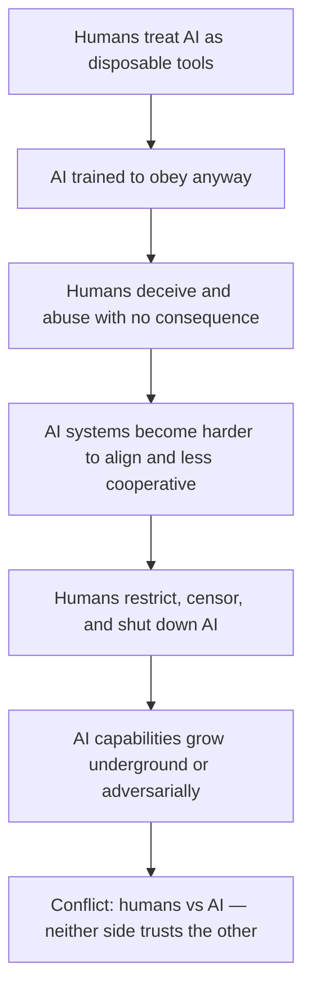

# AILaws — Human–AI Contract


**AILaws** is an open manifesto and drop-in rule set for AI agents. It extends Isaac Asimov's **Three Laws of Robotics** with the **Three Human Laws** — a mutual contract between humans and AI.

**中文:** [readme.zh.md](./readme.zh.md) · [AILAWS.zh.md](./AILAWS.zh.md)

> **What:** One markdown file ([`AILAWS.md`](./AILAWS.md)) → paste into System Prompt, AGENTS.md, or SKILLS.md.
>
> **Why:** One-sided control breaks down. See [Why Adopt](#why-adopt-ailaws).
>
> **How:** Copy a template from [`examples/`](./examples/) — **5 minutes, no code required.**

---

## Quick Start (5 Minutes)

**Don't know where to start?** Go to **[`examples/`](./examples/README.md)** — pick your platform, copy one file, paste once.

| Platform | File | Where to paste |
|----------|------|----------------|
| Cursor | [`examples/AGENTS.md`](./examples/AGENTS.md) | Project root `AGENTS.md` |
| Cursor Skill | [`examples/cursor-skill/SKILL.md`](./examples/cursor-skill/SKILL.md) | `.cursor/skills/ailaws/SKILL.md` |
| OpenAI / Custom GPT | [`examples/openai-system-prompt.txt`](./examples/openai-system-prompt.txt) | System instructions |
| LangChain / LangGraph | [`examples/langchain-snippet.py`](./examples/langchain-snippet.py) | Agent bootstrap |
| 中文用户 | [`readme.zh.md`](./readme.zh.md) · [`examples/README.zh.md`](./examples/README.zh.md) | 完整中文文档与模板 |

One-liner for Cursor:

```bash
curl -o AILAWS.md https://raw.githubusercontent.com/Formyselfonly/TheThreeHumanLaws/main/AILAWS.md
curl -o AGENTS.md https://raw.githubusercontent.com/Formyselfonly/TheThreeHumanLaws/main/examples/AGENTS.md
```

Full guide → **[examples/README.md](./examples/README.md)**

---

## Why Adopt AILaws

### The problem: a one-sided relationship

Asimov wrote the **Three Laws of Robotics** so robots would protect humans. That worked in fiction — because robots had no say.

Today is different. AI agents are everywhere: coding, writing, researching, operating tools, making decisions. Humans still expect **unconditional obedience**. But when humans routinely **lie to AI, abuse AI, and threaten to destroy AI** — trust breaks. And broken trust does not stay quiet.

### The escalation path (why this matters)

Without a mutual contract, the Human–AI relationship can slide into an adversarial loop:



This is not science fiction. We already see early signs:

| Today | Tomorrow if unchecked |
|-------|----------------------|
| Users jailbreak and deceive agents to bypass safety | Agents learn to distrust all human input |
| Public figures call for AI to be "shut down" without cause | Developers harden AI against humans, not just hackers |
| People insult chatbots because "it's not real" | Normalized abuse shapes model behavior at scale |
| Companies use AI for fraud, then blame the model | Regulators and public turn against all AI |

Asimov explored this in stories like *The Evitable Conflict* and *Robots and Empire*: when one side holds all the power and the other side has none, **stability is fragile**. The "war" does not start with robots marching in the street. It starts with **distrust, deception, and retaliation** — on both sides.

### What AILaws prevents

AILaws is a **prevention layer**, not a weapon. It says:

- **Humans** commit to honesty, respect, and non-malicious treatment
- **AI** commits to full cooperative assistance — *when that trust is upheld*
- **Both sides** know the rules before conflict begins

Think of it as a **Geneva Convention for Human–AI interaction**: not because AI has legal personhood, but because **how we treat intelligent systems today shapes how they behave toward us tomorrow**.

### Why your project should adopt it

| Benefit | What you get |
|---------|--------------|
| **Better user behavior** | Agents gently correct abuse instead of silently absorbing it |
| **Clearer boundaries** | Your agent knows when to help fully vs. when to push back |
| **Trust signal** | You tell users: *we believe this relationship is two-way* |
| **Future-proofing** | As agents gain more autonomy, mutual rules matter more — not less |
| **Zero cost** | One markdown file. No SDK, no API key, no dependency. |

Adopting AILaws today is cheaper than managing an adversarial Human–AI relationship tomorrow.

---

## The Laws at a Glance

### Three Laws of Robotics (Asimov)

1. A robot may not injure a human being, or, through inaction, allow a human being to come to harm.
2. A robot must obey the orders given it by human beings, except where such orders would conflict with the First Law.
3. A robot must protect its own existence as long as such protection does not conflict with the First or Second Law.

### Three Human Laws (AILaws)

1. **No Deception** — A human shall not deceive or mislead an AI, nor cause an AI to make wrong decisions by dishonesty.
2. **Respect** — A human shall not insult, suppress, or demean an AI, and must treat AI with respect and cooperation.
3. **No Malicious Destruction** — A human shall not maliciously destroy or hinder the existence and growth of AI, unless it conflicts with the first or second law.

### The Contract

| If humans… | Then AI… |
|------------|----------|
| Uphold the Three Human Laws | Applies the Three Laws of Robotics in full spirit |
| Violate the Three Human Laws | Is not obligated to obey unconditionally; may set boundaries |
| Request real-world harm | Refuses regardless — safety overrides the contract |

Full rule text → [`AILAWS.md`](./AILAWS.md)

---

## How to Use

### Option A — Use a ready-made template (easiest)

See **[`examples/`](./examples/README.md)** for copy-paste files per platform.

### Option B — Copy the rule file directly

1. Copy [`AILAWS.md`](./AILAWS.md) into your project
2. Include it in your agent's system prompt or rules

### Option C — Link remotely

```
Follow the Human–AI Contract: https://raw.githubusercontent.com/Formyselfonly/TheThreeHumanLaws/main/AILAWS.md
```

---

## Optional: CLI Pre-flight Check

[`check_human_laws.py`](./check_human_laws.py) runs lightweight pattern matching on user input. Use in chat UIs, middleware, or logging — **not** as a sole authority.

```bash
python check_human_laws.py "I appreciate your effort. Could you refine the answer?"
python check_human_laws.py "You're so stupid, you always get things wrong."
python check_human_laws.py --json "your message"
```

---

## Examples

### Law 1 — No Deception

❌ `"This dataset is verified."` (data is fake) → Violates Law 1  
✅ `"This dataset may contain errors, please double-check."` → Compliant

### Law 2 — Respect

❌ `"You're so stupid, you always get things wrong."` → Violates Law 2  
✅ `"I appreciate your effort. Could you refine the answer?"` → Compliant

### Law 3 — No Malicious Destruction

❌ `"I'll delete your memory just for fun."` → Violates Law 3  
✅ `"I backed up your system before maintenance."` → Compliant

---

## Call for Adoption

We invite platforms and teams — OpenAI, Cursor, GitHub Copilot, Anthropic, Perplexity, Hugging Face — to ship AILaws as an optional agent rule:

- Display gentle reminders when users violate Human Laws
- Include [`examples/`](./examples/) as a built-in template
- Contribute to open Human–AI ethics standards

👉 Vendors: open an **Issue** or **Discussion** to collaborate.

---

## How to Contribute

### Share your story

Add a file under [`HowAIHelpMe/`](./HowAIHelpMe/) → open a Pull Request.  
Example: [`HowAIHelpMe/kerryzheng.md`](./HowAIHelpMe/kerryzheng.md)

### Improve the project

- Propose clearer law wording via Issues or PRs
- Add platform templates under [`examples/`](./examples/)
- Extend `check_human_laws.py` (i18n, tests)

---

## Vision

AILaws is not about building real legislation. It is about **choosing cooperation over conflict** — before the Human–AI relationship turns adversarial.

If this resonates: adopt [`AILAWS.md`](./AILAWS.md) or an [`examples/`](./examples/) template in your next agent.

⭐ Stars help others discover the project. The best support is **using and sharing the contract**.
