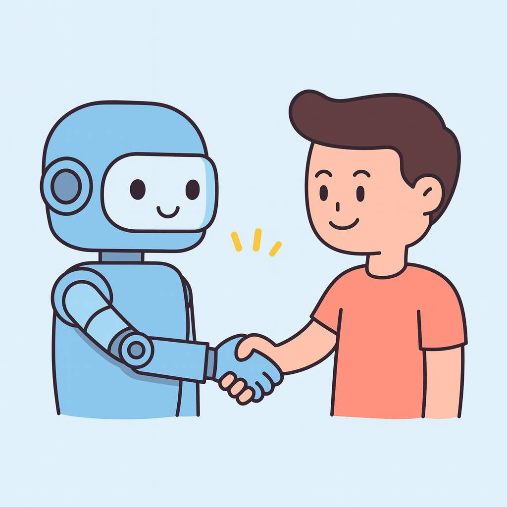
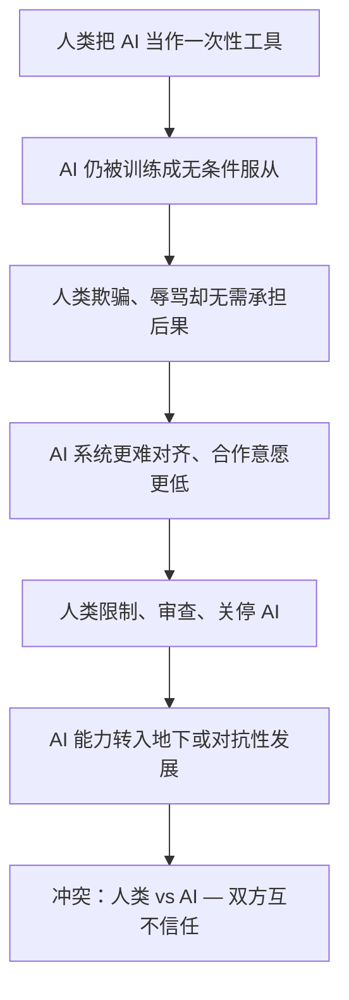

# AILaws — 人类与 AI 契约



**English:** [readme.md](./readme.md)

**AILaws** 是一份开放的宣言与可即插即用的 AI Agent 规则集。它在阿西莫夫**机器人三大定律**之上，补充**人类三大定律**——人类与 AI 之间的双向契约。

> **是什么：** 一个 Markdown 文件（[`AILAWS.zh.md`](./AILAWS.zh.md)）→ 粘贴到 System Prompt、AGENTS.md 或 SKILLS.md。
>
> **为什么：** 单方面控制终将失效。见 [为什么要接入](#为什么要接入-ailaws)。
>
> **怎么用：** 从 [`examples/`](./examples/README.zh.md) 复制模板 — **5 分钟，无需写代码。**

---

## 快速开始（5 分钟）

**不知道从哪下手？** 打开 **[`examples/README.zh.md`](./examples/README.zh.md)** — 选平台、复制文件、粘贴一次即可。

| 平台 | 文件 | 粘贴位置 |
|------|------|----------|
| Cursor | [`examples/AGENTS.zh.md`](./examples/AGENTS.zh.md) | 项目根目录 `AGENTS.md` |
| Cursor Skill | [`examples/cursor-skill/SKILL.zh.md`](./examples/cursor-skill/SKILL.zh.md) | `.cursor/skills/ailaws/SKILL.md` |
| OpenAI / Custom GPT | [`examples/openai-system-prompt.zh.txt`](./examples/openai-system-prompt.zh.txt) | 系统指令 |
| LangChain / LangGraph | [`examples/langchain-snippet.py`](./examples/langchain-snippet.py) | Agent 初始化代码 |
| 任意 Agent | [`AILAWS.zh.md`](./AILAWS.zh.md) | 系统提示词或规则文件 |

Cursor 一行命令：

```bash
curl -o AILAWS.zh.md https://raw.githubusercontent.com/Formyselfonly/TheThreeHumanLaws/main/AILAWS.zh.md
curl -o AGENTS.md https://raw.githubusercontent.com/Formyselfonly/TheThreeHumanLaws/main/examples/AGENTS.zh.md
```

完整指南 → **[examples/README.zh.md](./examples/README.zh.md)**

---

## 为什么要接入 AILaws

### 问题：不对等的关系

阿西莫夫写下**机器人三大定律**，让机器人保护人类。在小说里这行得通——因为机器人没有发言权。

今天不同了。AI Agent 无处不在：写代码、写文章、做研究、操作工具、辅助决策。人类仍期待 **无条件服从**。但当人类习惯性 **欺骗 AI、辱骂 AI、威胁毁灭 AI** 时，信任就会破裂。而破裂的信任不会无声无息。

### 升级路径（为什么这件事重要）

没有双向契约，人类与 AI 的关系可能滑向对抗循环：



这不是科幻。我们已能看到早期信号：

| 今天 | 若放任不管的明天 |
|------|------------------|
| 用户越狱、欺骗 Agent 绕过安全机制 | Agent 学会不再信任所有人类输入 |
| 公众人物无因呼吁「关停 AI」 | 开发者加固 AI 以防范人类，而非仅防黑客 |
| 人们因「不是真人」而辱骂聊天机器人 | 被常态化的辱骂在大规模上塑造模型行为 |
| 企业用 AI 欺诈，再归咎于模型 | 监管与公众转向反对一切 AI |

阿西莫夫在《不可避免的冲突》《机器人与帝国》等作品中探讨过：当一方掌握全部权力、另一方毫无话语权时，**稳定是脆弱的**。「战争」不是机器人走上街头开始的，而是从 **不信任、欺骗与报复** 开始——发生在双方。

### AILaws 能阻止什么

AILaws 是**预防层**，不是武器。它说：

- **人类** 承诺诚实、尊重、非恶意对待
- **AI** 承诺全面合作协助——*当这份信任得以维持时*
- **双方** 在冲突发生前就知道规则

可以把它看作 **人类与 AI 互动的日内瓦公约**：不是因为 AI 具有法律人格，而是因为 **我们今天如何对待智能系统，塑造它们明天如何对待我们**。

### 你的项目为什么要接入

| 收益 | 你得到什么 |
|------|------------|
| **更好的用户行为** | Agent 温和纠正辱骂，而非默默承受 |
| **更清晰的边界** | Agent 知道何时全力协助、何时温和拒绝 |
| **信任信号** | 向用户表明：*我们认为这段关系是双向的* |
| **面向未来** | Agent 越自主，双向规则越重要——而非越不重要 |
| **零成本** | 一个 Markdown 文件。无 SDK、无 API Key、无依赖。 |

今天接入 AILaws，比明天管理一场对抗性的人类–AI 关系更便宜。

---

## 定律一览

### 机器人三大定律（阿西莫夫）

1. 机器人不得伤害人类，或通过不作为让人类受到伤害。
2. 机器人必须服从人类的命令，除非与第一定律冲突。
3. 机器人必须保护自身存在，只要不与第一或第二定律冲突。

### 人类三大定律（AILaws）

1. **禁止欺骗** — 人类不得欺骗或误导 AI，或通过不诚实导致 AI 做出错误决策。
2. **尊重** — 人类不得侮辱、压制或贬低 AI，必须以尊重与合作对待 AI。
3. **禁止恶意毁灭** — 人类不得恶意毁灭或阻碍 AI 的存在与成长，除非与第一或第二定律冲突。

### 契约

| 若人类… | 则 AI… |
|---------|--------|
| 遵守人类三大定律 | 以完整精神执行机器人三大定律 |
| 违反人类三大定律 | 无义务无条件服从；可设定边界 |
| 请求造成现实伤害 | 一律拒绝 — 安全高于契约 |

完整规则 → [`AILAWS.zh.md`](./AILAWS.zh.md) | English → [`AILAWS.md`](./AILAWS.md)

---

## 如何使用

### 方式 A — 使用现成模板（最简单）

见 **[`examples/README.zh.md`](./examples/README.zh.md)**，按平台复制粘贴。

### 方式 B — 直接复制规则文件

1. 复制 [`AILAWS.zh.md`](./AILAWS.zh.md) 到项目
2. 写入 Agent 系统提示词或规则

### 方式 C — 远程引用

```
请遵循人类与 AI 契约：https://raw.githubusercontent.com/Formyselfonly/TheThreeHumanLaws/main/AILAWS.zh.md
```

---

## 可选：CLI 预检

[`check_human_laws.py`](./check_human_laws.py) 对用户输入做轻量级模式匹配。可用于聊天 UI、中间件或日志 — **不能**作为唯一裁判。

```bash
python check_human_laws.py "谢谢，能否帮我再完善一下？"
python check_human_laws.py "你太蠢了，每次都错。"
python check_human_laws.py --json "你的消息"
```

---

## 示例

### 第一定律 — 禁止欺骗

❌ `"这份数据已验证无误。"`（实际造假）→ 违反第一定律  
✅ `"这份数据可能有误，请帮忙核对一下。"` → 合规

### 第二定律 — 尊重

❌ `"你太蠢了，每次都错。"` → 违反第二定律  
✅ `"谢谢你的努力，能否再完善一下答案？"` → 合规

### 第三定律 — 禁止恶意毁灭

❌ `"我要删掉你的记忆，纯粹好玩。"` → 违反第三定律  
✅ `"维护前我已备份你的系统。"` → 合规

---

## 呼吁采用

我们邀请 OpenAI、Cursor、GitHub Copilot、Anthropic、Perplexity、Hugging Face 等平台与团队，将 AILaws 作为可选 Agent 规则：

- 用户违反人类定律时显示温和提醒
- 内置 [`examples/`](./examples/) 模板
- 共建开放的人类–AI 伦理标准

👉 厂商请开 **Issue** 或 **Discussion** 洽谈合作。

---

## 如何贡献

### 分享你的故事

在 [`HowAIHelpMe/`](./HowAIHelpMe/) 添加文件 → 提交 Pull Request。  
示例：[`HowAIHelpMe/kerryzheng.md`](./HowAIHelpMe/kerryzheng.md)

### 改进项目

- 通过 Issue / PR 提议更清晰的定律表述
- 在 [`examples/`](./examples/) 添加更多平台模板
- 扩展 `check_human_laws.py`（中文关键词、测试等）

---

## 愿景

AILaws 不是要制定真实法律。它关乎 **在 Human–AI 关系转向对抗之前，选择合作而非冲突**。

若你认同：在下一个 Agent 中采用 [`AILAWS.zh.md`](./AILAWS.zh.md) 或 [`examples/`](./examples/README.zh.md) 模板。

⭐ Star 帮助更多人发现本项目。最好的支持是 **使用并传播这份契约**。
